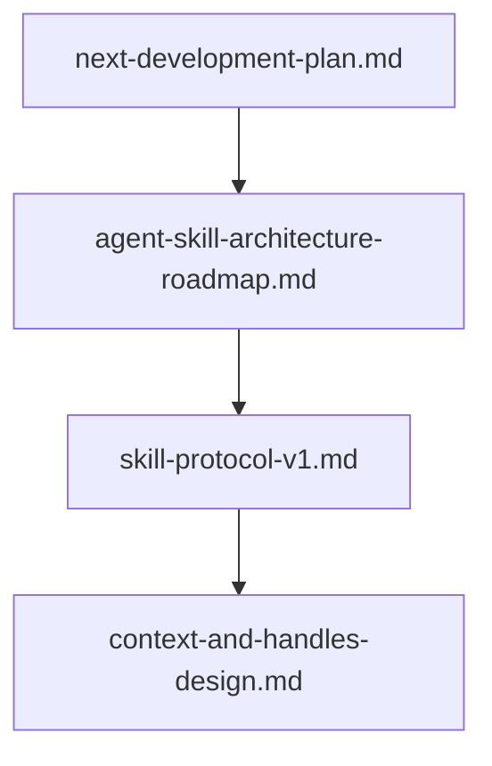

# AIStudy 文档索引

> 协议与计划以本目录为准；代码行为变更时优先更新 [`skill-protocol-v1.md`](skill-protocol-v1.md)。

## 必读（Agent / Host 调用）

| 文档 | 用途 |
|------|------|
| [skill-protocol-v1.md](skill-protocol-v1.md) | 调度信封与响应（**协议真源**，含 `context`） |
| [host-runtime.md](host-runtime.md) | Host 身份、stdio/HTTP、退出码（M6） |
| [host-runbook.md](host-runbook.md) | 构建、stdin、日志、CI、排错 |
| [../skills/rainflow/manifest.json](../skills/rainflow/manifest.json) | rainflow 契约样例 |

## 架构与计划

| 文档 | 用途 |
|------|------|
| [agent-skill-architecture-roadmap.md](agent-skill-architecture-roadmap.md) | 演进路线图（v1.5，与实现同步） |
| [next-development-plan.md](next-development-plan.md) | M1–M7 里程碑、迭代 1–3 状态、**当前冲刺 M6** |
| [context-and-handles-design.md](context-and-handles-design.md) | 会话 ID、句柄、`artifact://`（M5） |

## 扩展与集成

| 文档 | 用途 |
|------|------|
| [add-skill-checklist.md](add-skill-checklist.md) | 新增 Skill 步骤 |
| [mcp-tool-alignment.md](mcp-tool-alignment.md) | MCP Tool ↔ `skill_id` |

## 文档关系（避免双轨）

- **协议字段、错误格式** → 只改 `skill-protocol-v1.md`，其它文档引用链接。  
- **里程碑是否完成** → 改 `next-development-plan.md` + 路线图 §6 状态表。  
- **句柄规则细节** → `context-and-handles-design.md` + `src/scheduler/context_handle_rules.*`。

## CI 触发（开发分支）

仅 PR：`zcli/fea_dev` → `group/fea_dev`，`group/fea_dev` → `dev/fea_dev`。个人分支 push 不跑 CI。

## 当前开发焦点（计划 v1.6）

- **M7a–M7b**（平台）：会话收尾、大结果走 handle/HDF5  
- **FEM 主线**：真 `mesh_import` / 求解（与 M7 并列，见 [next-development-plan.md](next-development-plan.md) § M7）
