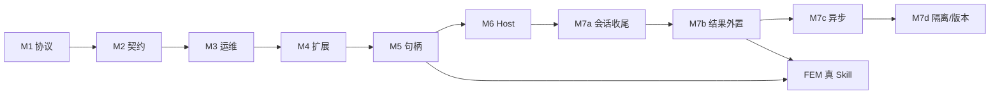

# AIStudy 下一步开发计划

> 文档版本：1.6  
> 日期：2026-05-21  
> 依据：`dosc/agent-skill-architecture-roadmap.md`（v1.5）、`dosc/skill-protocol-v1.md`、当前仓库实现（M1–M5b、CI）  
> 性质：**规划文档**，不包含实现任务的具体 PR/分支安排  

---

## 1. 文档目的

在阶段 A/B/C（契约、注册、会话句柄最小实现）已落地的前提下，明确：

1. **当前真实能力边界**（与路线图、协议文档的差异）；
2. **近期必须补齐的缺口**（协议与实现一致、可测试、可观测）；
3. **中期向 FEM 仿真 Skill 演进** 的优先级与依赖；
4. **分里程碑交付物与验收标准**，供后续迭代对照。

**不在本文范围内：** 具体代码修改、排期人天（需团队按人力单独评估）。

---

## 2. 当前基线（代码快照）

### 2.1 已具备

| 能力 | 实现 |
|------|------|
| 三层架构 | `kernel` / `adapter` / `scheduler` + `common/*` |
| 内置 Skill | `rainflow`、`host_echo`、`mesh_import`（后者为 M5 会话/句柄**样板**，非真实导入） |
| 协议 v1 | `dosc/skill-protocol-v1.md` 与 `skill_protocol` 一致（含 `context` §2.4） |
| 调度入口 | `Dispatcher::execute`、`skill_registry` + `skill_registry_bindings.txt` / CMake 校验 |
| 信封解析 | `protocol: "1"`、`skill_id`、`payload`；可选 `context`、`options.timeout_ms` |
| 调度前校验 | `skill_payload_validator`（aistudy-schema-v1 子集 + 字段路径 `error.message`） |
| Context / 句柄 | `ContextStore`、`context_handle_rules`、`skill_execution_context`（见设计文档） |
| 统一错误模型 | `StatusOr` + `api_response`（v1 `ok`/`error`/`meta`） |
| 发现与探活 | `--list`、`--describe`、`--health`；stdin `execute` |
| 可观测性 | `AIstudy.Dispatcher` 请求级日志；manifest 失败 → `load_errors` + stderr |
| 质量门禁 | GTest 契约（rainflow / host_echo / mesh_import / context 等）；**GitHub Actions** [`.github/workflows/ci.yml`](../.github/workflows/ci.yml) |
| 文档入口 | 根目录 [`README.md`](../README.md) + `dosc/host-runbook.md` |

### 2.2 仍待办（代码或文档）

| 项 | 说明 |
|----|------|
| JSON Schema 高级子集 | `oneOf`/`anyOf`/`pattern` 等；`default` 未在运行时应用 |
| 全 Skill golden | `host_echo` / `mesh_import` 有契约测试；非 rainflow 的负例 golden 可继续补 |
| FEM 真实能力 | `mesh_import` 为 stub；求解/导出 Skill、HDF5 真实网格 I/O 未做 |
| `file_` → `mesh_` 文档化两步流 | M5 迭代 3 叙事：`mesh_import` + 同 `context_id` 已测；独立 `file_` 注册链待补 |
| 会话生命周期 | 无 TTL / `context_close`；Store 跟进程存活（M7） |
| `kBindings` 代码生成 | CMake 校验已有；C++ 表仍手工维护 |
| M6 对外集成 | ✅ stdio 退出码、`host-runtime.md`、HTTP `--serve`；MCP 文档对齐 |
| M7 规模能力（平台） | 拆为 M7a–M7d；见 §5；与 **FEM 主线**（真网格/求解）分列 |

### 2.3 技术债（建议纳入近期清理）

- ~~`api_response` 遗留 `success` 双轨~~ → 已收敛为 `makeSkillApiResponse` / `makeSkillApiFailureResponse`。
- ~~`rainflow.schema.json` 双份维护~~ → 已删除，契约仅以 `skills/rainflow/manifest.json` 为准。
- ~~`common/status` 与 `common/common_status` 双路径~~ → 目录统一为 `src/common/status`，`#include "common/status/..."`（CMake 目标名 `common_status`）。

---

## 3. 规划原则

1. **协议单一真相**：以 `skill-protocol-v1.md` 为准；代码行为与文档不一致时，优先改代码或显式修订文档，不长期双轨。
2. **rainflow 作样板，FEM 作目标**：雨流模块验证「manifest → 调度 → adapter → kernel」流水线；下一批 Skill 应对准仿真主路径（网格/材料/求解/后处理之一）。
3. **平台能力不进 Skill 表**：`status` / `io` / `logger` 继续作为库被各层调用，不注册为 `skill_id`。
4. **架构规则优先**：跨模块禁函数指针；大对象对外仅句柄 ID；函数指针若保留，仅限 scheduler 进程内静态表（当前做法可接受，中期用代码生成降低手工成本）。
5. **先可测、后可观测、再可扩展部署**：契约测试与日志优先于 HTTP/MCP/子进程 Skill。

---

## 4. 里程碑总览

| 里程碑 | 名称 | 目标 | 建议优先级 |
|--------|------|------|------------|
| **M1** | 协议与实现收敛 | ✅ 已完成 |
| **M2** | 契约与质量门禁 | ✅ 已完成 |
| **M3** | Skill Host 可运维 | ✅ 已完成 |
| **M4** | Skill 扩展工程化 | ✅ 已完成 |
| **M5** | FEM 会话与句柄（设计+最小实现） | ✅ M5a+M5b 已完成（样板级） |
| **M6** | 对外集成面 | ✅ 已完成（MCP 为文档桥接，无独立 Server 二进制） |
| **M7** | 规模能力（平台） | ⏳ **当前冲刺**；拆 M7a→M7b→M7c→M7d |
| **FEM 主线** | 领域 Skill（非 M7 四条表） | 与 M7b 并行；真 `mesh_import` / 求解 / 导出 |

---

## 5. 里程碑详述

### M1：协议与实现收敛（P0）

**目标：** Host 行为与 `skill-protocol-v1.md` 完全一致，Agent 只需实现一种请求/响应。

| 任务 | 交付物 | 验收 |
|------|--------|------|
| 强制 `protocol == "1"` | 修改 `parseSkillEnvelope`：无 protocol 或版本不对 → 校验错误 | ✅ 已实现 |
| 统一响应路径 | `Dispatcher::execute` 仅 `makeSkillApiResponse` / `makeSkillApiFailureResponse` | ✅ 已实现 |
| 清理遗留 API | 删除 `makeApiSuccessResponse`、`makeApiResponse`、`success` 字段 | ✅ 已实现 |
| 同步路线图 | 更新 `agent-skill-architecture-roadmap.md` §2.2、§3.1、附录 | ✅ 路线图 v1.4 |
| 统一 status 模块路径 | `src/common/status`，include `common/status/...` | ✅ 已实现 |

**依赖：** 无。  
**工作量：** 小（1 个迭代内可完成）。

---

### M2：契约与质量门禁（P0）

**目标：** Agent 仅依赖 manifest 即可可靠调用；回归可自动化。

| 任务 | 交付物 | 验收 |
|------|--------|------|
| rainflow 契约测试 | `skills/rainflow/tests/`：`request.json` + `expected_ok.json` / `expected_error.json` | ✅ GTest `rainflow_contract_test`（忽略 `request_id`/`duration_ms`） |
| 加强 payload 校验 | aistudy-schema-v1 子集 + 字段级 `error.message` | ✅ 已实现；含 `additionalProperties`/`minItems` 与 rainflow 负例 GTest |
| manifest 加载失败可观测 | 失败记入 `load_errors` + 日志/stderr + GTest | ✅ `SkillRegistry.RecordsLoadFailureWhenManifestMissing` + `SkillManifestLoad.RejectsManifestWithoutId` |
| 删除重复 schema 源 | 以 manifest 为唯一契约 | ✅ 已删除 `rainflow.schema.json` |

**依赖：** M1（测试断言基于 v1 响应）。  
**工作量：** 中。

---

### M3：Skill Host 可运维（P1）

**目标：** 单次 `execute` 可追踪、可探活，满足脚本/Cursor 侧排错。

| 任务 | 交付物 | 验收 |
|------|--------|------|
| 请求级日志 | `Dispatcher::execute` 入口/出口：`common/logger` 记录 `request_id`、`skill_id`、`duration_ms`、`ok`、错误码 | ✅ `AIstudy.Dispatcher`；`dosc/host-runbook.md` §4 |
| `health` 能力 | CLI：`AIstudy --health` 或 JSON capability；检查 Poco/HDF5/已注册 Skill 数 | ✅ `healthJson()` + GTest `SkillHostHealth` |
| 超时预留 | 解析信封 `options.timeout_ms`（可先记录日志，再实现取消） | ✅ `skill_protocol` 解析 + 日志注明 not enforced |
| stdin 使用说明 | `dosc/` 下补充「Host 运行手册」：工作目录、`AISTUDY_PROJECT_ROOT`、manifest 路径 | ✅ `dosc/host-runbook.md` |

**依赖：** M1。  
**工作量：** 中。

---

### M4：Skill 扩展工程化（P1）

**目标：** 新增 Skill 流程标准化，降低 `kBindings` 手工维护成本。

| 任务 | 交付物 | 验收 |
|------|--------|------|
| 《新增 Skill 检查清单》 | `dosc/add-skill-checklist.md`：manifest → kernel → adapter → registry → tests | ✅ |
| 注册表校验 | `cmake/AistudySkills.cmake` + `skill_registry_bindings.txt` | ✅ manifest 与 binding 不一致时 configure 失败 |
| 第二个样板 Skill | `host_echo` + adapter + 契约测试 | ✅ `--list` ≥2；GTest `HostEchoContract` / `ListIncludesAtLeastTwoSkills` |
| MCP 对齐说明 | `dosc/mcp-tool-alignment.md` | ✅ skill_id ↔ Tool、describe ↔ schema |

**依赖：** M2 清单模板。  
**工作量：** 中。

---

### M5：FEM 会话与句柄（P1，仿真主线）

**目标：** 为「导入网格 → 求解 → 导出」多步流程奠定调度层能力；rainflow / host_echo 保持无状态。

**依赖：** M1、M2；HDF5（`common/io/hdf5`）用于 M5b artifact。  
**工作量：** 大；拆为 **M5a（设计+约定）**、**M5b（最小实现）**。

---

#### M5a：Context / 句柄设计基线（P1）

**目标：** 评审通过的设计与可测试的句柄约定；**不改变** `Dispatcher::execute` 与现有 Skill 行为。

| 任务 | 交付物 | 验收 |
|------|--------|------|
| 设计文档 | `dosc/context-and-handles-design.md`：信封 `context` JSON、`context_id`、句柄生命周期、HDF5 `artifact://`、M5b 接口 | ✅ |
| 类型与约定代码 | `skill_context_types.h`、`context_handle_rules.*` | ✅ `isValidHandleId` / `parseContextObject` |
| Store 接口声明 | `skill_context_store.h` + M5a 占位 stub（返回未实现） | ✅ M5b 填充实现 |
| 单元测试 | `context_handle_rules_test` | ✅ GTest 合法/非法 handle、context 解析 |
| 协议文档索引 | 设计文档 §2 与 `skill-protocol-v1` 对齐说明 | ✅ |

**明确不在 M5a：** 信封 `context` 写入 `SkillEnvelope`、Dispatcher 调 Store、adapter 签名变更、FEM Skill。

---

#### M5b：Context Store 与首个 FEM Skill 骨架（P1）

**目标：** 同一 `context_id` 跨两次 `execute` 可注册/查询句柄；可选极简 `mesh_import` 样板。

| 任务 | 交付物 | 验收 |
|------|--------|------|
| 解析 `context` | `skill_protocol`：`SkillEnvelope` 增加 `context_id`、`inbound_handles` | ✅ `SkillProtocol.ParsesEnvelopeContext` |
| Context Store 实现 | `skill_context_store.cpp` + `skill_artifact_paths` | ✅ `context_store_test` |
| Dispatcher 集成 | merge inbound + `context_id` 日志 + `skill_execution_context` | ✅ `ContextWorkflow.TwoStepShareContextId` |
| 句柄错误 message | `parseContextObjectDetailed` + `lastEnvelopeValidationDetail` | ✅ 字段路径进 `error.message` |
| 首个 FEM Skill | `mesh_import` manifest + adapter + kernel stub | ✅ `MeshImportContract`；`--list` ≥3 |
| artifact 目录 | `.aistudy/artifacts/<context_id>/` | ✅ `ensureArtifactContextDir` |

**M5 遗留（非阻塞 M6）：** 文档化 `file_` → `mesh_` 业务两步流；`mesh_import` 接真实 HDF5/网格内核。

---

### M6：对外集成面（P2）— ✅ 已完成

**目标：** Agent Runtime 与计算内核解耦部署。

| 任务 | 交付物 | 验收 |
|------|--------|------|
| Skill Host 身份明确 | [`dosc/host-runtime.md`](host-runtime.md) + `src/host/skill_host.*` | ✅ |
| stdio 协议固化 | 退出码 0/1/2/3；[`scripts/stdio_stress.ps1`](../scripts/stdio_stress.ps1) | ✅ GTest `HostExitCode.*` |
| HTTP JSON API | `AIstudy --serve [port]`：`GET /v1/health`、`/v1/skills`、`POST /v1/execute` | ✅ 本地 curl |
| MCP Server | [`mcp-tool-alignment.md`](mcp-tool-alignment.md) + stdio 子进程方式 | ✅ 文档；无独立 MCP 二进制 |

**依赖：** M1–M3。  
**工作量：** 中–大。

---

### M7：规模能力（P3）— 平台层，当前建议冲刺

**目标：** Host 能扛 **长任务、大结果、会话收尾**；隔离与多版本按需后置。  
**说明：** 长耗时**仿真算法**属 **FEM 主线**（真 `mesh_import` / 求解 Skill），不替代 M7 平台任务；M7c 验收需至少一个「真的慢」Skill（可为 `host_slow` mock 或 FEM 求解骨架）。

**依赖：** M5 句柄与 artifact、`common/io/hdf5`、M6 stdio/HTTP。  
**与 M6 衔接：** 同步 `execute` / `POST /v1/execute` 保留短任务；异步走 M7c 新信封或 `/v1/jobs`（实现时定稿进 `skill-protocol-v1.md`）。

---

#### M7a：会话收尾（P1，建议先做）✅

| 任务 | 交付物 | 验收 |
|------|--------|------|
| `context_close` / TTL | Store：`dropContext`/`closeContext`/`purgeExpiredContexts`；Skill `context_close`；信封 `context.close`；CLI `--drop-context` | ✅ `context_store_test`、`context_close_contract_test` |
| 与 M5 设计对齐 | 更新 `context-and-handles-design.md` §5.4 | ✅ |

**工作量：** 小。

---

#### M7b：大结果外置（P1，建议先做）

| 任务 | 交付物 | 验收 |
|------|--------|------|
| 结果写 artifact | 大数组/场数据经 `common/io/hdf5` 写入 `.aistudy/artifacts/` | 响应 `result` 仅含 `*_handle` 字符串，不传大块数组 |
| 协议/manifest 约定 | `skill-protocol-v1` + 示例 Skill 的 `output_schema` | Agent 从 handle + `getArtifact` 取数 |
| 与 M5 衔接 | `putHandle` / inbound `context.handles` | 两步流可不重复 payload 大对象 |

**工作量：** 中。可与 **FEM 主线**（真网格导入）并行。

---

#### M7c：异步执行（P2）

| 任务 | 交付物 | 验收 |
|------|--------|------|
| `execute_async` | 返回 `job_id`；内存 Job Store | 协议扩展（`skill-protocol-v1` § 待增） |
| `poll` / `get_result` | CLI 或 HTTP：`GET /v1/jobs/{id}` | stdin/HTTP **不阻塞**至长任务结束 |
| 慢 Skill 验收 | `host_slow` mock 或 FEM 求解 stub（sleep） | GTest：提交 job → poll → 取结果 |
| 超时（可选） | `options.timeout_ms` 取消 job（与 M3 日志预留衔接） | 超时后 job 失败可查询 |

**工作量：** 中–大。建议在 M7a/M7b 之后、且已有慢 Skill 再做。

---

#### M7d：隔离与多版本（P3–P4，可选后置）

| 任务 | 交付物 | 验收 |
|------|--------|------|
| 子进程 Skill | 独立 EXE + stdio JSON，scheduler 转发 | 崩溃隔离；`kBindings` 仍手工，投入大 |
| 版本并存 | `skill_id@2` 或 manifest 多版本目录 | 破坏性变更可共存；无发版需求可延后 |

**工作量：** 大（子进程）；版本并存为小–中。

---

### FEM 主线（与 M7 并列，非 M7 子项）

**目标：** 产品向「导入 → 求解 → 导出」，复用 M5 句柄与（M7b 后）artifact 外置。

| 任务 | 说明 | 建议顺序 |
|------|------|----------|
| `file_` → `mesh_` 文档 + golden | 补 `dosc` 两步流示例与测试 | M7b 前后均可 |
| 真 `mesh_import` | kernel 读入 + HDF5 网格 artifact | 与 M7b 并行 |
| 求解 / 导出 Skill | 读 `mesh_` 句柄，写 `result_` 句柄 | 在 mesh 之后 |

**依赖：** M5b、优先 M7b 的「大结果走 handle」约定。  
**不纳入 M7 四条表的原因：** 避免把 M7 误解为「做求解器」；平台能力与领域算法分列。

---

## 6. 推荐实施顺序（三个迭代 + 当前焦点）

### 迭代 1：可信 Host — ✅ 已完成

- **M2** rainflow golden + manifest 加载失败可观测  
- **M3** 结构化日志 + `--health`  
- **验收：** `skill-protocol-v1.md` + `skills/rainflow/manifest.json` + `AIstudy.exe` 可完成成功/失败调用；CI 在 PR `zcli/fea_dev`→`group/fea_dev` 与 `group/fea_dev`→`dev/fea_dev` 上跑 `ctest -C Release`（见 [`.github/workflows/ci.yml`](../.github/workflows/ci.yml)）

### 迭代 2：可运维 + 扩展套路 — ✅ 已完成

- **M4** `add-skill-checklist.md`、CMake 注册校验、`host_echo`  
- **M2** schema 子集 + 字段路径 `error.message`  
- **验收：** `request_id` 可 grep；新 Skill 可按清单接入（无需改 `main.cpp`）

### 迭代 3：仿真主线启动 — ✅ 主体完成

- **M5a/M5b** 设计、Store、`context` 信封、`mesh_import` 样板、`ContextWorkflow` 测试  
- **遗留：** `file_`→`mesh_` 文档化 golden；真实网格导入

### 迭代 4：平台规模 + FEM 起步（当前建议冲刺）

**平台（推荐顺序）：**

1. **M7a** 会话收尾（`context_close` / TTL）  
2. **M7b** 大结果外置（HDF5 + 响应仅 handle）  
3. **M7c** 异步 job（需慢 Skill 验收）  
4. **M7d** 子进程 / 多版本 — 按需  

**FEM 主线（可与 M7a/M7b 并行）：**

1. `file_` → `mesh_` 文档化 golden  
2. 真 `mesh_import`（替代 M5b 样板）  
3. 求解 / 导出 Skill 骨架  

**迭代 4 验收（平台最小）：** M7a+M7b 完成；至少一个 Skill 演示「大结果仅 handle」；M7c 或 FEM 真网格二选一有可见进展即可，不必一次做完 M7 全表。

---

## 7. 与路线图阶段对照

| 路线图阶段 | 本计划映射 | 说明 |
|------------|------------|------|
| 阶段 A | M1 + M2 | ✅ 已完成 |
| 阶段 B | M4 | ✅ 已完成；子进程见 M7 |
| 阶段 C | M6 | ✅ 已完成 |
| 阶段 D | M5 + M7a–M7c + FEM 主线 | M5b ✅；平台 M7 与真 FEM Skill 分列推进 |
| 阶段 E | M2 + M3 + CI | ✅ 已完成；指标等待办 |

---

## 8. 明确暂不安排（避免范围蔓延）

| 项 | 原因 |
|----|------|
| 预编译 `common` 三库 | 路线图 §9：协议未完全冻结前，源码构建更利于调试 |
| 内置 Workflow DAG | Agent 外置多轮 `execute` 即可；内置编排投入高 |
| 将 logger 注册为 Skill | 违反平台/领域分层 |
| 大规模插件动态加载 | 优先静态表 + 代码生成；ABI 管理成本高 |
| 多个 FEM 模块并行开发 | M5 句柄已完成；建议 **M7a/M7b 与单一 FEM Skill（如真 mesh_import）** 交错推进，避免同时开 M7c+子进程+求解 |
| M7 四条一次性全做 | 拆 M7a→M7d；子进程/多版本后置 |

---

## 9. 成功标准（3 个月视角）

1. **契约：** ✅ 对外 JSON 符合 `skill-protocol-v1.md`；rainflow + CI 契约测试。  
2. **扩展：** ✅ `add-skill-checklist` + `host_echo`；无需改 `main.cpp`。  
3. **仿真：** ✅ 样板 + Store；⏳ **FEM 主线**（真网格/求解）与 **M7b** 外置结果。  
4. **Agent：** ✅ M6 接入；⏳ M7c 长任务不阻塞 stdin/HTTP。  
5. **文档：** ✅ 协议真源 `skill-protocol-v1.md`；M7 扩展（async/jobs）须先改协议再改代码。  
6. **规模（M7 结案）：** M7a 会话可收尾 + M7b 大结果走 handle +（可选）M7c 异步有慢 Skill 验收。

---

## 10. 参考文档

| 文档 | 路径 |
|------|------|
| 项目入口 | [`README.md`](../README.md) |
| 架构演进路线图 | [`dosc/agent-skill-architecture-roadmap.md`](agent-skill-architecture-roadmap.md)（v1.5） |
| 调度协议 v1（**协议真源**） | [`dosc/skill-protocol-v1.md`](skill-protocol-v1.md) |
| Context / 句柄 | [`dosc/context-and-handles-design.md`](context-and-handles-design.md) |
| Host 运行与 CI | [`dosc/host-runbook.md`](host-runbook.md) |
| Host 运行时（M6） | [`dosc/host-runtime.md`](host-runtime.md) |
| 新增 Skill | [`dosc/add-skill-checklist.md`](add-skill-checklist.md) |
| MCP 对齐 | [`dosc/mcp-tool-alignment.md`](mcp-tool-alignment.md) |
| 架构强制规则 | `.cursor/rules/fem-simulation-architecture.mdc` |
| rainflow 契约 | `skills/rainflow/manifest.json` |

---

## 11. 修订记录

| 版本 | 日期 | 说明 |
|------|------|------|
| 1.0 | 2026-05-21 | 基于路线图 v1.3 与当前代码差距分析，制定 M1–M7 与三迭代计划 |
| 1.1 | 2026-05-21 | 路线图 v1.4 同步；M1 协议/API 收敛 |
| 1.2 | 2026-05-21 | `rainflow.schema.json` 移除；manifest 为唯一 schema |
| 1.3 | 2026-05-21 | 模块路径统一为 `src/common/status` |
| 1.4 | 2026-05-21 | 同步 M1–M5b 完成态、CI、迭代 1–3 结案、当前冲刺 M6；§2 基线重写；路线图 v1.5 |
| 1.5 | 2026-05-21 | M6：`host/`、`host-runtime.md`、stdio 退出码、HTTP `--serve`、`stdio_stress.ps1` |
| 1.6 | 2026-05-21 | M7 拆为 M7a–M7d + FEM 主线分列；迭代 4 与优先级重排 |

---

*实施时若与 `.cursor/rules/fem-simulation-architecture.mdc` 冲突，以规则文件为准并先与负责人确认。*
