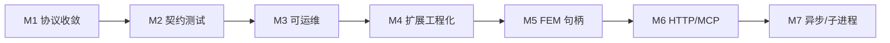

# AIStudy 下一步开发计划

> 文档版本：1.0  
> 日期：2026-05-21  
> 依据：`dosc/agent-skill-architecture-roadmap.md`、`dosc/skill-protocol-v1.md`、当前仓库代码快照  
> 性质：**规划文档**，不包含实现任务的具体 PR/分支安排  

---

## 1. 文档目的

在阶段 A/B（Skill 契约 + 静态注册）已基本落地的前提下，明确：

1. **当前真实能力边界**（与路线图、协议文档的差异）；
2. **近期必须补齐的缺口**（协议与实现一致、可测试、可观测）；
3. **中期向 FEM 仿真 Skill 演进** 的优先级与依赖；
4. **分里程碑交付物与验收标准**，供后续迭代对照。

**不在本文范围内：** 具体代码修改、排期人天（需团队按人力单独评估）。

---

## 2. 当前基线（代码快照）

### 2.1 已具备

| 能力 | 实现 |
|------|------|
| 三层架构 | `kernel` / `adapter` / `scheduler` + `common/*` |
| 唯一示例 Skill | `rainflow`（`kernel` + `adapter` + `skills/rainflow/manifest.json`） |
| 协议 v1 文档 | `dosc/skill-protocol-v1.md`（规范态，无遗留格式） |
| 调度入口 | `Dispatcher::execute`、`registerSkill`、`skill_registry` 静态表 |
| 信封解析 | `skill_protocol`（`skill_id`、`payload`、`protocol` 可选识别） |
| 调度前校验 | `skill_payload_validator`（manifest `required` 字段） |
| 统一错误模型 | `StatusOr` + `api_response`（v1 `ok`/`error`/`meta`） |
| 发现能力 | CLI：`AIstudy --list`、`--describe <skill_id>`、stdin `execute` |
| 横切库 | `common/status`、`common/io`（json/hdf5）、`common/logger` 已接入构建 |

### 2.2 与规范/文档仍不一致或未完成

| 项 | 规范/目标 | 代码现状 | 风险 |
|----|-----------|----------|------|
| 仅 protocol v1 | `skill-protocol-v1.md` 要求 `protocol: "1"` 必填 | `protocol` 可省略；省略时响应仍为 `{ "success": ... }` | Agent 与 Host 契约分裂 |
| 信封字段 | 仅 `skill_id` | 已移除 `task_type` 注册路径；解析层也不再兼容 `task_type` | 与旧路线图 §2.2 描述不一致（文档待同步） |
| JSON Schema 校验 | 成熟平台「执行前 schema 校验」 | 仅 `required` 存在性 | 类型/enum 错误仍在 adapter 才暴露 |
| 契约测试 | 每 Skill `tests/*.json` | **无** `tests/` 目录 | 回归靠手工 |
| 结构化日志 | `request_id` + `skill_id` + `duration_ms` | scheduler **未** 调用 `common/logger` | 难排查生产问题 |
| `health` | 路线图 §4.4 | 未实现 | 部署/探活缺失 |
| `context` / `options` | 协议预留 | **未解析** | FEM 多步前需设计 |
| 注册失败策略 | manifest 缺失应可见 | `registerBuiltinSkills` 加载失败 **静默 skip** | 部署路径错误时 Skill 消失且无告警 |
| Skill 扩展 | 自动发现 / 代码生成 | 手工维护 `kBindings[]` | Skill 增多后易漏注册 |
| FEM 领域 Skill | 网格/求解/结果 | 仅 rainflow 练习模块 | 产品主线未启动 |

### 2.3 技术债（建议纳入近期清理）

- `api_response` 仍保留 `makeApiSuccessResponse` / `success` 等遗留 API，与 `makeSkillApiResponse` 双轨。
- `src/kernel/rainflow/rainflow.schema.json` 与 `skills/rainflow/manifest.json` 可能双份维护。
- 仓库内仍存在 `src/common/common_status` 与 `src/common/status` 并行路径（历史别名），增加认知成本。
- `agent-skill-architecture-roadmap.md` §2.2、§3.1 仍描述 `task_type`、`rainflow_schema()`、`registerAdapter` 等已删除/已变更内容，**需单独修订路线图**，避免与本文档、协议 v1 冲突。

---

## 3. 规划原则

1. **协议单一真相**：以 `skill-protocol-v1.md` 为准；代码行为与文档不一致时，优先改代码或显式修订文档，不长期双轨。
2. **rainflow 作样板，FEM 作目标**：雨流模块验证「manifest → 调度 → adapter → kernel」流水线；下一批 Skill 应对准仿真主路径（网格/材料/求解/后处理之一）。
3. **平台能力不进 Skill 表**：`status` / `io` / `logger` 继续作为库被各层调用，不注册为 `skill_id`。
4. **架构规则优先**：跨模块禁函数指针；大对象对外仅句柄 ID；函数指针若保留，仅限 scheduler 进程内静态表（当前做法可接受，中期用代码生成降低手工成本）。
5. **先可测、后可观测、再可扩展部署**：契约测试与日志优先于 HTTP/MCP/子进程 Skill。

---

## 4. 里程碑总览

| 里程碑 | 名称 | 目标 | 建议优先级 |
|--------|------|------|------------|
| **M1** | 协议与实现收敛 | 代码仅支持 protocol v1；删除遗留响应路径 | P0 |
| **M2** | 契约与质量门禁 | Schema 校验加强 + golden 测试 + 注册可见错误 | P0 |
| **M3** | Skill Host 可运维 | 结构化日志、`health`、manifest 扫描策略 | P1 |
| **M4** | Skill 扩展工程化 | 注册表生成/扫描、`skills/` 约定固化 | P1 |
| **M5** | FEM 会话与句柄（设计+最小实现） | `context` 解析 + Context Store + 首个「有状态」Skill 设计 | P1（仿真主线） |
| **M6** | 对外集成面 | stdio 稳定化 → 可选 HTTP/MCP；独立 Host EXE | P2 |
| **M7** | 规模能力 | 异步 job、artifact 外置、子进程 Skill | P3 |

---

## 5. 里程碑详述

### M1：协议与实现收敛（P0）

**目标：** Host 行为与 `skill-protocol-v1.md` 完全一致，Agent 只需实现一种请求/响应。

| 任务 | 交付物 | 验收 |
|------|--------|------|
| 强制 `protocol == "1"` | 修改 `parseSkillEnvelope`：无 protocol 或版本不对 → 校验错误 | 发送无 `protocol` 的信封得到 v1 格式 `ok: false` |
| 统一响应路径 | `Dispatcher::execute` 始终 `makeProtocolV1*`；移除 `makeApiFailureResponse`/`success` 分支 | 成功/失败响应均含 `protocol`、`request_id`、`ok`、`meta` |
| 清理遗留 API | 评估删除或内部化 `makeApiSuccessResponse`、`makeApiResponse`（若无其它调用方） | 全仓库无 `success` 响应字段 |
| 同步路线图 | 更新 `agent-skill-architecture-roadmap.md` §2.2、§3.1、附录 | 文档与代码一致 |

**依赖：** 无。  
**工作量：** 小（1 个迭代内可完成）。

---

### M2：契约与质量门禁（P0）

**目标：** Agent 仅依赖 manifest 即可可靠调用；回归可自动化。

| 任务 | 交付物 | 验收 |
|------|--------|------|
| rainflow 契约测试 | `skills/rainflow/tests/`：`request.json` + `expected_ok.json` / `expected_error.json` | CI 或本地脚本对比 `execute` 输出（可允许 `request_id` 字段忽略） |
| 加强 payload 校验 | 在 `skill_payload_validator` 或 `common/io/json` 上增加：类型、enum、`minimum` 等（可先子集 JSON Schema） | manifest 中 `method` 非法 enum 在调度层失败，错误 `category=validation` |
| manifest 加载失败可观测 | `registerBuiltinSkills`：失败时日志/启动警告；可选 `--list` 显示 `load_error` | manifest 路径错误时 `--list` 可见异常 |
| 删除重复 schema 源 | 移除或标记废弃 `kernel/rainflow/rainflow.schema.json`，以 manifest 为唯一契约 | 仅 `skills/rainflow/manifest.json` 为 Agent 输入 |

**依赖：** M1（测试断言基于 v1 响应）。  
**工作量：** 中。

---

### M3：Skill Host 可运维（P1）

**目标：** 单次 `execute` 可追踪、可探活，满足脚本/Cursor 侧排错。

| 任务 | 交付物 | 验收 |
|------|--------|------|
| 请求级日志 | `Dispatcher::execute` 入口/出口：`common/logger` 记录 `request_id`、`skill_id`、`duration_ms`、`ok`、错误码 | 日志行可 grep `request_id` 串联一次调用 |
| `health` 能力 | CLI：`AIstudy --health` 或 JSON capability；检查 Poco/HDF5/已注册 Skill 数 | 返回 `{ "ok": true, "skills_loaded": N, ... }` |
| 超时预留 | 解析信封 `options.timeout_ms`（可先记录日志，再实现取消） | 文档与代码对 `options` 行为一致 |
| stdin 使用说明 | `dosc/` 下补充「Host 运行手册」：工作目录、`AISTUDY_PROJECT_ROOT`、manifest 路径 | 从非仓库根目录启动仍能加载 `skills/` 或明确失败原因 |

**依赖：** M1。  
**工作量：** 中。

---

### M4：Skill 扩展工程化（P1）

**目标：** 新增 Skill 流程标准化，降低 `kBindings` 手工维护成本。

| 任务 | 交付物 | 验收 |
|------|--------|------|
| 《新增 Skill 检查清单》 | `dosc/add-skill-checklist.md`：manifest → kernel → adapter → registry → tests | 团队可按清单新增第二个练习 Skill |
| 注册表生成（可选） | CMake 扫描 `skills/*/manifest.json` 生成 `skill_registry.generated.cpp` 或校验 `kBindings` 与目录一致 | 存在 manifest 无 binding 时配置失败 |
| 第二个样板 Skill（可选） | 极简 `echo` 或 `version` Skill，验证多 Skill 列表与路由 | `--list` 返回 ≥2 项 |
| MCP 对齐说明 | 文档映射：`skill_id` ↔ Tool name，`describe` ↔ parameters schema | 便于 Cursor Agent 配置 |

**依赖：** M2 清单模板。  
**工作量：** 中。

---

### M5：FEM 会话与句柄（P1，仿真主线）

**目标：** 为「导入网格 → 求解 → 导出」多步流程奠定调度层能力；rainflow 保持无状态。

| 任务 | 交付物 | 验收 |
|------|--------|------|
| Context 设计文档 | `dosc/context-and-handles-design.md`：`context_id`、`handles` 生命周期、与 HDF5 artifact 关系 | 评审通过后再写代码 |
| 解析 `context` | `skill_protocol` + `SkillEnvelope` 增加 `context` 对象（可选） | v1 信封可带 `context`，未带时行为不变 |
| Context Store（内存版） | scheduler 内 `context_id → map<handle_id, ArtifactMeta>` | 两次 `execute` 传递同一 `context_id` 可复用句柄 |
| 句柄类型约定 | 字符串 ID 规范：`mesh_*`、`result_*`、`file_*`；禁止指针出进程 | 符合 `fem-simulation-architecture.mdc` |
| 首个 FEM 向 Skill（选型） | 建议优先：**网格导入** 或 **结果写 HDF5**，而非直接上求解器 | 完成 1 个端到端 manifest + adapter + kernel 骨架 |

**依赖：** M1、M2；HDF5 模块（`common/io/hdf5`）用于 artifact。  
**工作量：** 大（可分 M5a 设计 / M5b 最小实现）。

---

### M6：对外集成面（P2）

**目标：** Agent Runtime 与计算内核解耦部署。

| 任务 | 交付物 | 验收 |
|------|--------|------|
| Skill Host 身份明确 | `AIstudy` 定位为 Host：仅 list/describe/execute/health | README 或 `dosc/host-runtime.md` |
| stdio 协议固化 | 一行 JSON in、一行 JSON out；约定退出码 | 脚本 100 次调用无挂起 |
| HTTP JSON API（可选） | 本地 `POST /v1/execute` | curl 可调用 rainflow |
| MCP Server（可选） | 暴露 list/describe/execute 为 MCP tools | Cursor 可配置 MCP 调用 rainflow |

**依赖：** M1–M3。  
**工作量：** 中–大。

---

### M7：规模能力（P3）

**目标：** 长耗时仿真、多 Skill 隔离。

| 任务 | 交付物 | 验收 |
|------|--------|------|
| `execute_async` | 返回 `job_id`；`poll` / `get_result` | 长任务不阻塞 stdin |
| 大结果外置 | 结果写入 HDF5，响应仅 `artifact_handle` | payload 不传大数组 |
| 子进程 Skill | 独立 EXE + stdio JSON，scheduler 转发 | 崩溃隔离 |
| 版本并存 | `skill_id@2` 或 manifest 多版本目录 | 破坏性变更可共存 |

**依赖：** M5 句柄与 artifact 体系。  
**工作量：** 大。

---

## 6. 推荐实施顺序（接下来 3 个迭代）

### 迭代 1（当前冲刺）：可信 Host

1. **M1** 协议与实现收敛（全 v1 响应、必填 `protocol`）  
2. **M2** rainflow golden 测试 + manifest 加载失败告警  
3. 修订 `agent-skill-architecture-roadmap.md` 过时章节  

**迭代 1 验收：** 外部 Agent 仅读 `skill-protocol-v1.md` + `skills/rainflow/manifest.json` + `AIstudy.exe`，即可完成成功/失败调用；CI 跑通 rainflow 契约测试。

### 迭代 2：可运维 + 扩展套路

1. **M3** 结构化日志 + `--health`  
2. **M4** 《新增 Skill 检查清单》+ 注册一致性校验（CMake 或脚本）  
3. **M2** 扩展 schema 校验（enum/类型）  

**迭代 2 验收：** 一次错误调用可通过 `request_id` 在日志定位；新 Skill 可按文档在 1 天内接入（含测试目录）。

### 迭代 3：仿真主线启动

1. **M5a** Context/句柄设计评审  
2. **M5b** Context Store 最小实现 + 解析 `context`  
3. 选定 **第一个 FEM Skill**（网格或结果 IO），走完整 kernel → adapter → manifest 流程  

**迭代 3 验收：** 文档化的两步工作流（如「导入 → 查询句柄」）无需在 payload 重复传大对象。

---

## 7. 与路线图阶段对照

| 路线图阶段 | 本计划映射 | 说明 |
|------------|------------|------|
| 阶段 A | M1 + M2 | A 已基本完成；重点是**收敛遗留响应**与**测试** |
| 阶段 B | M1 + M4 | 静态表已有；补生成/校验与子进程方案（M7） |
| 阶段 C | M6 | Host 分离与传输 |
| 阶段 D | M5 + M7 | 句柄、异步、artifact |
| 阶段 E | M2 + M3 | 契约测试、日志、指标（指标可放在 M3 之后） |

---

## 8. 明确暂不安排（避免范围蔓延）

| 项 | 原因 |
|----|------|
| 预编译 `common` 三库 | 路线图 §9：协议未完全冻结前，源码构建更利于调试 |
| 内置 Workflow DAG | Agent 外置多轮 `execute` 即可；内置编排投入高 |
| 将 logger 注册为 Skill | 违反平台/领域分层 |
| 大规模插件动态加载 | 优先静态表 + 代码生成；ABI 管理成本高 |
| 多个 FEM 模块并行开发 | 应先完成 M5 句柄设计，再开求解/网格 |

---

## 9. 成功标准（3 个月视角）

1. **契约：** 所有对外 JSON 符合 `skill-protocol-v1.md`；rainflow 有自动化契约测试。  
2. **扩展：** 新增第 2 个 Skill 有文档化清单且无需改 `main.cpp`。  
3. **仿真：** 存在 1 个 FEM 向 Skill 原型 + Context/句柄设计落地（至少内存 Store）。  
4. **Agent：** Cursor/脚本通过 stdin（或 MCP）稳定调用 Host，具备 `health` 与请求级日志。  
5. **文档：** 路线图、协议、本计划三者一致，无 `task_type`/`success` 等过时描述。

---

## 10. 参考文档

| 文档 | 路径 |
|------|------|
| 架构演进路线图 | `dosc/agent-skill-architecture-roadmap.md` |
| 调度协议 v1（规范） | `dosc/skill-protocol-v1.md` |
| 架构强制规则 | `.cursor/rules/fem-simulation-architecture.mdc` |
| rainflow 契约 | `skills/rainflow/manifest.json` |

---

## 11. 修订记录

| 版本 | 日期 | 说明 |
|------|------|------|
| 1.0 | 2026-05-21 | 基于路线图 v1.3 与当前代码差距分析，制定 M1–M7 与三迭代计划 |

---

*实施时若与 `.cursor/rules/fem-simulation-architecture.mdc` 冲突，以规则文件为准并先与负责人确认。*
